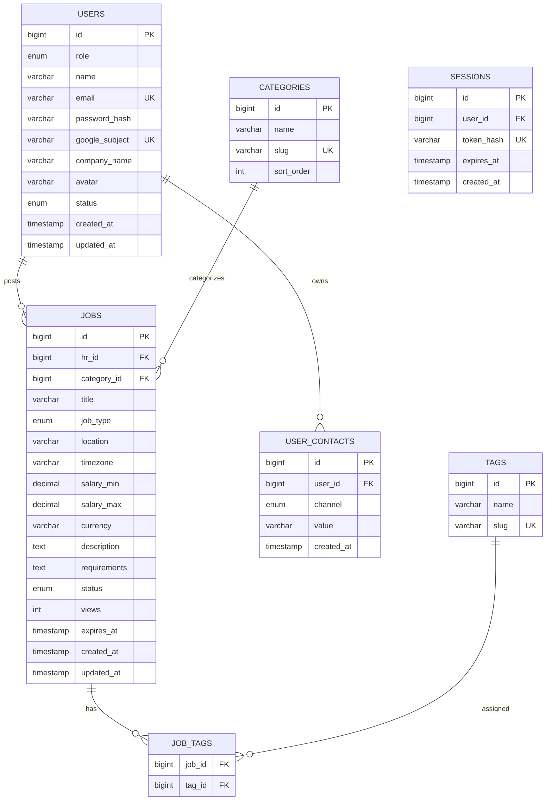

# Database Schema

## 1. ER Diagram

## 2. users

| Column | Type | Constraints |
|---|---|---|
| id | BIGINT | PK |
| role | ENUM | `hr`, `admin` |
| name | VARCHAR(100) | NOT NULL |
| email | VARCHAR(255) | UNIQUE, NOT NULL |
| password_hash | VARCHAR(255) | NULL |
| google_subject | VARCHAR(255) | UNIQUE, NULL |
| company_name | VARCHAR(150) | NULL |
| avatar | VARCHAR(500) | NULL |
| status | ENUM | `pending`, `active`, `blocked` |
| created_at | TIMESTAMP | NOT NULL |
| updated_at | TIMESTAMP | NOT NULL |

Rules:
- `password_hash` NULL nếu account chưa liên kết password.
- `google_subject` NULL nếu account chưa liên kết Google.
- Account có thể có cả hai.
- Email unique.
- Admin được seed/create bằng controlled process, không tự đăng ký public.
- `pending` là trạng thái HR chưa được admin duyệt.
- `blocked` không được sử dụng các quyền HR.

## 3. user_contacts

| Column | Type | Constraints |
|---|---|---|
| id | BIGINT | PK |
| user_id | BIGINT | FK users.id |
| channel | ENUM | zalo/telegram/linkedin/phone/email |
| value | VARCHAR(255) | NOT NULL |
| created_at | TIMESTAMP | NOT NULL |

Constraint:
- `UNIQUE(user_id, channel)` trong MVP.
- FK xóa theo policy đã định; không cascade xóa user nếu business policy yêu cầu giữ audit data.

## 4. categories

| Column | Type | Constraints |
|---|---|---|
| id | BIGINT | PK |
| name | VARCHAR(100) | NOT NULL |
| slug | VARCHAR(120) | UNIQUE, NOT NULL |
| sort_order | INT | DEFAULT 0 |

Category do admin/system quản lý.

Ví dụ:
- Backend
- Frontend
- Fullstack
- Mobile
- DevOps / SysAdmin
- Data / AI / ML
- QA / Test
- UI/UX Designer

## 5. tags

| Column | Type | Constraints |
|---|---|---|
| id | BIGINT | PK |
| name | VARCHAR(50) | NOT NULL |
| slug | VARCHAR(60) | UNIQUE, NOT NULL |

Tag do admin/system quản lý.

HR chỉ chọn tag có sẵn.

## 6. jobs

| Column | Type | Constraints |
|---|---|---|
| id | BIGINT | PK |
| hr_id | BIGINT | FK users.id, NOT NULL |
| category_id | BIGINT | FK categories.id, NOT NULL |
| title | VARCHAR(200) | NOT NULL |
| job_type | ENUM | fulltime/parttime/freelance/contract |
| location | VARCHAR(150) | NULL |
| timezone | VARCHAR(50) | NULL |
| salary_min | DECIMAL(12,2) | NULL |
| salary_max | DECIMAL(12,2) | NULL |
| currency | VARCHAR(10) | NULL |
| description | TEXT | NOT NULL |
| requirements | TEXT | NULL |
| status | ENUM | draft/pending/approved/rejected/closed/hidden/expired |
| views | INT | DEFAULT 0 |
| expires_at | TIMESTAMP | NULL |
| created_at | TIMESTAMP | NOT NULL |
| updated_at | TIMESTAMP | NOT NULL |

Rules:
- `hr_id` là owner.
- `company_name` không copy vào jobs; lấy từ HR.
- Contact không copy vào jobs; lấy từ HR.
- `views` là total detail-page views.
- Salary có thể NULL để biểu diễn "thỏa thuận".
- `salary_min <= salary_max` nếu cả hai tồn tại.
- Job public phải là approved và chưa hết hạn.

## 7. job_tags

Composite primary key:
- `(job_id, tag_id)`

Không cho duplicate pair.

## 8. sessions

Session server-side.

| Column | Type | Constraints |
|---|---|---|
| id | BIGINT | PK |
| user_id | BIGINT | FK users.id |
| token_hash | VARCHAR(255) | UNIQUE, NOT NULL |
| expires_at | TIMESTAMP | NOT NULL |
| created_at | TIMESTAMP | NOT NULL |

Không lưu raw session token trong database nếu implementation sử dụng hash.

## 9. Delete policy

MVP ưu tiên soft/controlled deletion cho dữ liệu quan trọng.

Không hard-delete HR nếu việc đó làm mất ownership/history của job mà admin cần quản lý.

Khi HR bị block:
- Account vẫn tồn tại.
- Jobs không tự động bị xóa.
- Public visibility của jobs của blocked HR phải tuân theo moderation policy.
- Policy cụ thể phải được triển khai nhất quán ở backend.

Khi xóa job:
- Job không còn public.
- Quan hệ job_tags phải được dọn dẹp.
- Không để orphan records.

## 10. Indexes

Tối thiểu:
- users.email
- users.google_subject
- jobs.hr_id
- jobs.category_id
- jobs.status
- jobs.created_at
- jobs.expires_at
- job_tags.tag_id
- job_tags.job_id
- user_contacts(user_id, channel)

Có thể bổ sung PostgreSQL full-text/trigram indexes sau khi benchmark search thực tế.
