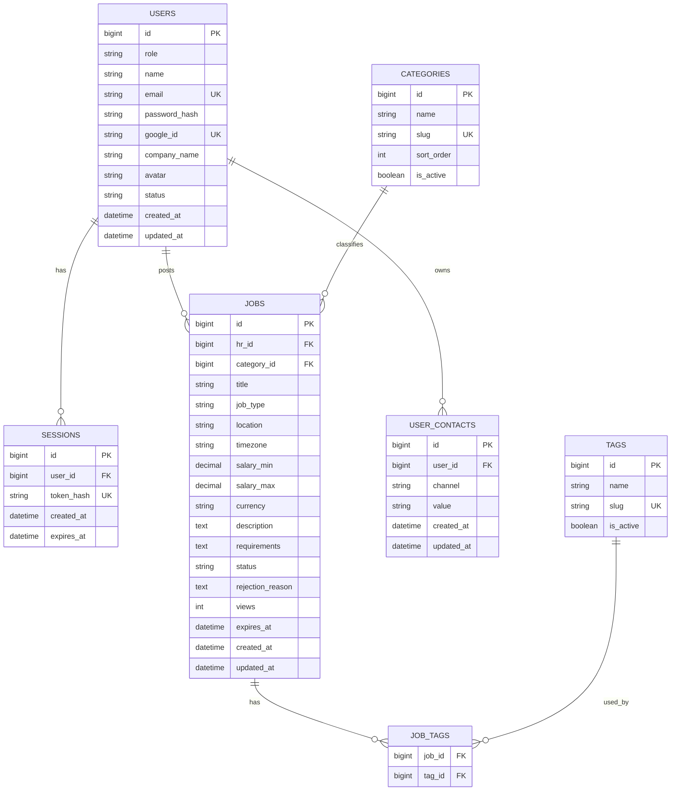

# Database Schema — Remote IT Job

## 1. Database

Database chính thức: PostgreSQL.

ORM: SQLAlchemy 2.x.
Migration: Alembic.

## 2. ER Diagram



## 3. users

| Column | Type | Constraint |
|---|---|---|
| id | BIGINT | PK |
| role | VARCHAR/enum | NOT NULL, `hr/admin` |
| name | VARCHAR(100) | NOT NULL |
| email | VARCHAR(255) | UNIQUE, NOT NULL |
| password_hash | VARCHAR(255) | NULL |
| google_id | VARCHAR(255) | UNIQUE, NULL |
| company_name | VARCHAR(150) | NULL |
| avatar | VARCHAR(500) | NULL |
| status | VARCHAR/enum | NOT NULL, `pending/active/blocked` |
| created_at | TIMESTAMP | NOT NULL |
| updated_at | TIMESTAMP | NOT NULL |

Quy tắc:
- HR có thể xác thực qua password, Google, hoặc cả hai nếu sau này thêm account-linking.
- `password_hash` NULL khi chưa có password.
- `google_id` NULL khi chưa liên kết Google.
- Tài khoản HR mới bắt đầu với trạng thái `pending`.
- Tài khoản Admin được seed và bắt đầu với trạng thái `active`.
- HR bị blocked không được sử dụng chức năng HR.

## 4. sessions

| Column | Type | Constraint |
|---|---|---|
| id | BIGINT | PK |
| user_id | BIGINT | FK → users.id |
| token_hash | VARCHAR(255) | UNIQUE, NOT NULL |
| created_at | TIMESTAMP | NOT NULL |
| expires_at | TIMESTAMP | NOT NULL |

Session là server-side.

Lưu hash/opaque identifier thay vì raw session secret trong database.

Session hết hạn có thể được dọn dẹp định kỳ.

## 5. user_contacts

Các kênh được hỗ trợ:
- zalo
- telegram
- linkedin
- phone
- email

Một HR có thể có nhiều kênh liên hệ.

Ràng buộc database:
- `UNIQUE(user_id, channel)` — mỗi HR có tối đa một giá trị liên hệ cho mỗi kênh.

Contact thuộc về HR profile, không bị trùng lặp trên mỗi job.

## 6. categories

Category được quản lý bởi hệ thống/Admin.

Ví dụ khởi tạo:
- Backend
- Frontend
- Fullstack
- Mobile
- DevOps / SysAdmin
- Data / AI / ML
- QA / Test
- UI/UX Designer

Trường:
- id
- name
- slug
- sort_order
- is_active

Không hard-delete category đã được job tham chiếu; thay vào đó deactivate.

## 7. tags

Tag được quản lý bởi hệ thống/Admin.

Ví dụ:
- React
- TypeScript
- Python
- FastAPI
- Node.js
- PostgreSQL
- Docker

Trường:
- id
- name
- slug
- is_active

Không hard-delete tag đã được tham chiếu; thay vào đó deactivate.

## 8. jobs

| Column | Type | Constraint |
|---|---|---|
| id | BIGINT | PK |
| hr_id | BIGINT | FK → users.id, NOT NULL |
| category_id | BIGINT | FK → categories.id, NOT NULL |
| title | VARCHAR(200) | NOT NULL |
| job_type | VARCHAR/enum | NOT NULL |
| location | VARCHAR(150) | NULL |
| timezone | VARCHAR(50) | NULL |
| salary_min | DECIMAL(12,2) | NULL |
| salary_max | DECIMAL(12,2) | NULL |
| currency | VARCHAR(10) | NULL |
| description | TEXT | NOT NULL |
| requirements | TEXT | NOT NULL |
| status | VARCHAR/enum | NOT NULL |
| rejection_reason | TEXT | NULL |
| views | INTEGER | NOT NULL, default 0 |
| expires_at | TIMESTAMP | NULL |
| created_at | TIMESTAMP | NOT NULL |
| updated_at | TIMESTAMP | NOT NULL |

Loại job:
- fulltime
- parttime
- freelance
- contract

Currency được hỗ trợ ban đầu:
- VND
- USD
- EUR
- SGD
- JPY
- GBP

Không gán salary về 0 khi không công khai lương. Dùng NULL.

## 9. job status

```text
draft
pending
approved
rejected
closed
hidden
expired
```

Transitions:

```text
draft → pending
pending → approved
pending → rejected
rejected → pending
approved → closed
approved → hidden
approved → expired
```

Sau khi sửa substantive content trên job đã approved:

```text
approved → pending
```

Các trường substantive bao gồm title, description, requirements, salary, location, job type, category và tags.

## 10. job_tags

Composite primary key:

```text
(job_id, tag_id)
```

Ngăn chặn gán trùng tag.

## 11. Foreign key behavior

Khuyến nghị:
- users → jobs: giữ lại job khi HR bị block; visibility được kiểm soát bởi trạng thái HR.
- users → sessions: cascade delete session hết hạn hoặc session của user chỉ khi policy xóa tài khoản cho phép.
- users → contacts: contact có thể bị xóa khi tài khoản HR bị xóa vĩnh viễn.
- categories/tags → jobs: ưu tiên RESTRICT/soft deactivation thay vì hard delete.
- jobs → job_tags: CASCADE khi xóa job.

"Xóa" HR trong admin UI thường có nghĩa là deactivation/soft delete thay vì hard delete hủy diệt.

## 12. Indexes

Tối thiểu cần có:
- users(email)
- users(google_id)
- users(status, role)
- sessions(token_hash)
- sessions(user_id)
- sessions(expires_at)
- jobs(status, created_at)
- jobs(category_id, status)
- jobs(hr_id, status)
- jobs(expires_at, status)
- job_tags(tag_id, job_id)

Search indexes có thể được thêm sau khi đo lường hành vi query thực tế.

## 13. Expiration

Public query phải kiểm tra:

```text
status = approved
AND
(expires_at IS NULL OR expires_at > NOW())
```

Một periodic task có thể cập nhật job hết hạn sang `expired`.

Periodic task dùng để đồng bộ trạng thái database, không phải cơ chế duy nhất ngăn job hết hạn hiển thị.

## 14. View tracking

Cột `jobs.views` lưu tổng số lượt xem.

Implementation phải ngăn cùng một server-side session tăng view của cùng một job quá một lần trong 24 giờ.

Nếu dùng bảng view-tracking riêng, cần có uniqueness/indexing phù hợp cho `(job_id, session_id, time window)` và xử lý concurrent request an toàn.
