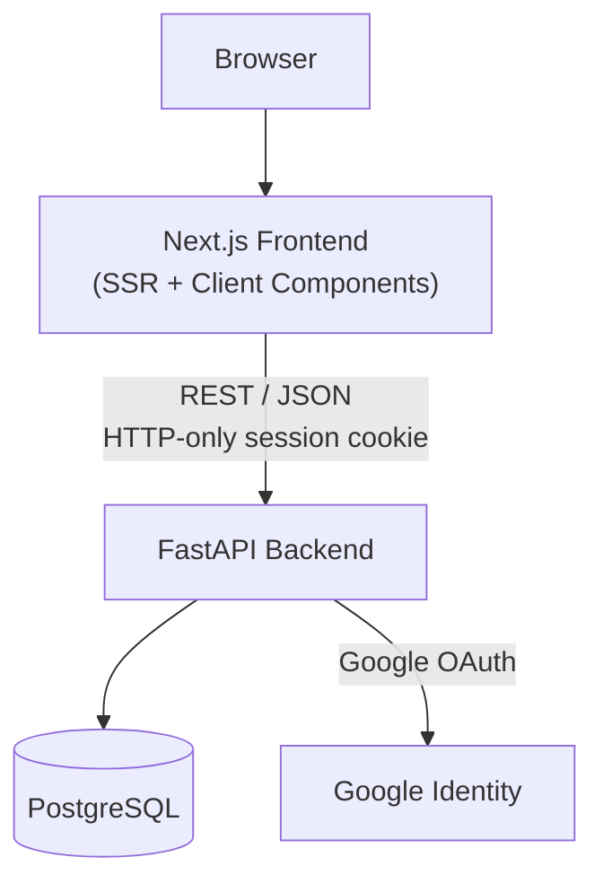
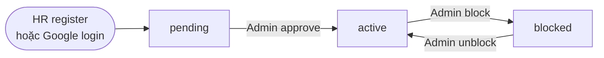
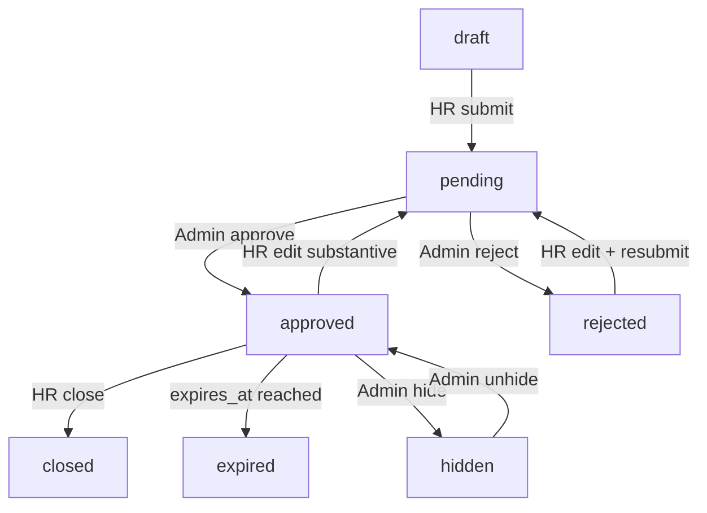
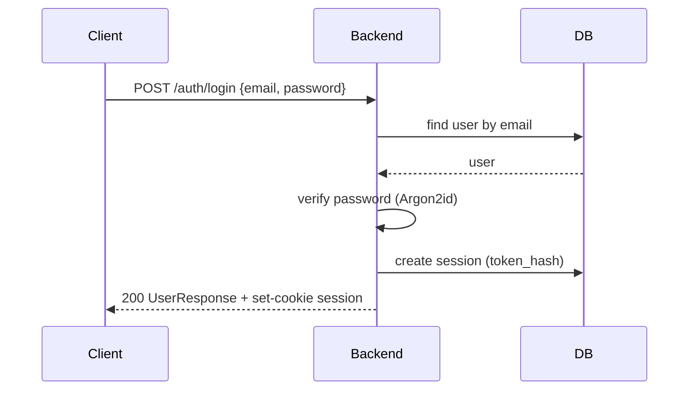
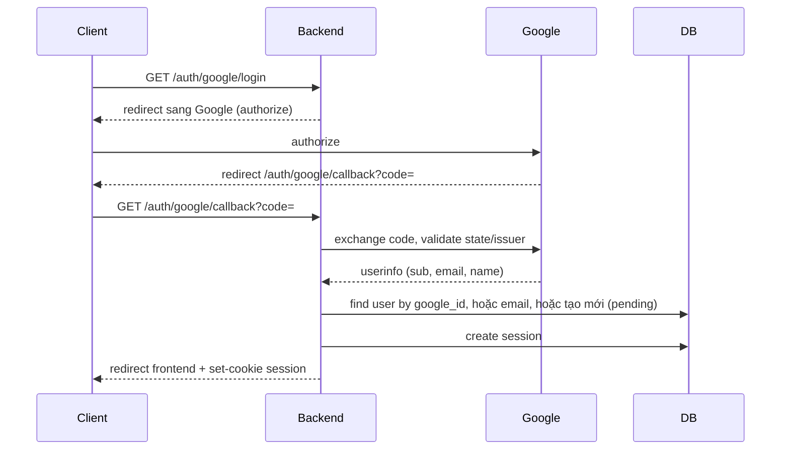
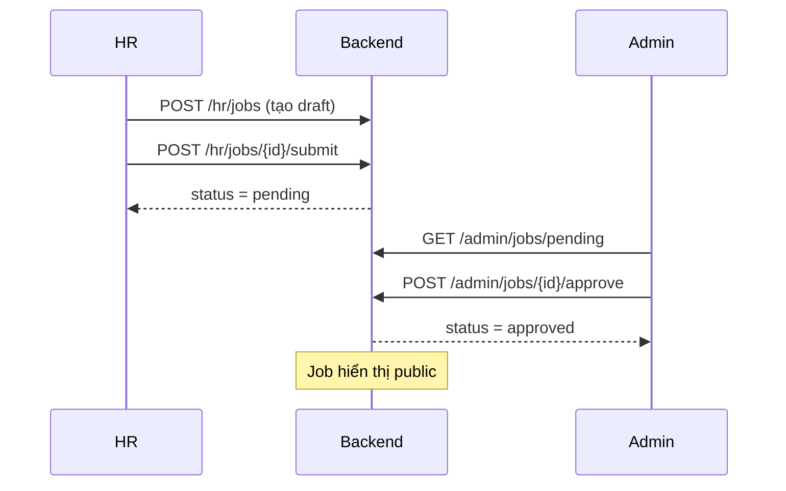
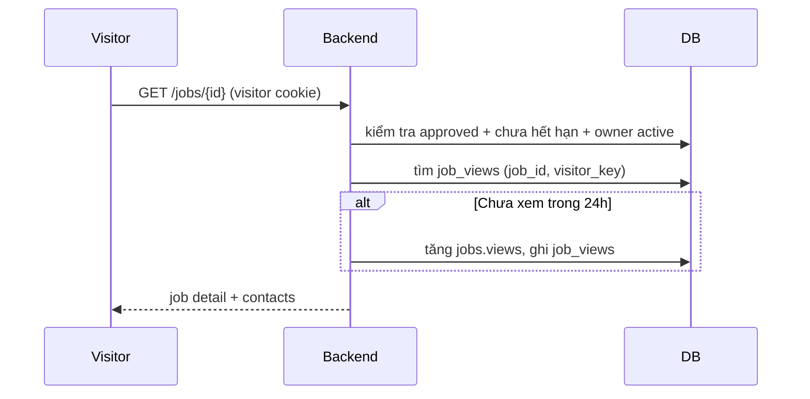
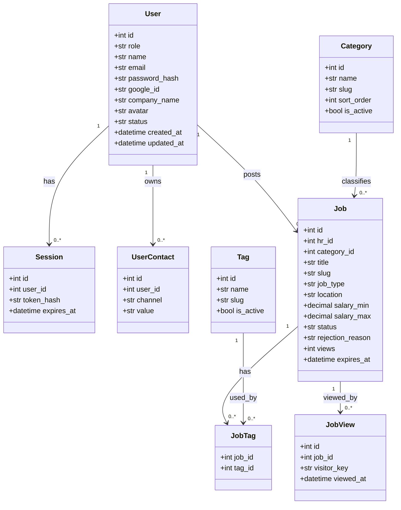

# Diagrams — Remote IT Job

Các sơ đồ kiến trúc, luồng nghiệp vụ và sequence bằng Mermaid.

## 1. Kiến trúc tổng thể



## 2. Kiến trúc phân lớp backend

```mermaid
flowchart TB
    R[API Routes] --> S[Services<br/>(business logic)]
    S --> Rep[Repositories<br/>(data access)]
    Rep --> M[SQLAlchemy Models]
    Rep --> D[("PostgreSQL")]
    S --> Sch[Pydantic Schemas]
    R --> Sch
```

## 3. User lifecycle (HR)



## 4. Job lifecycle



## 5. Sequence — Đăng nhập email/password



## 6. Sequence — Google OAuth



## 7. Sequence — Đăng tin và kiểm duyệt



## 8. Sequence — Xem job và đếm view



## 9. Class diagram — Models


